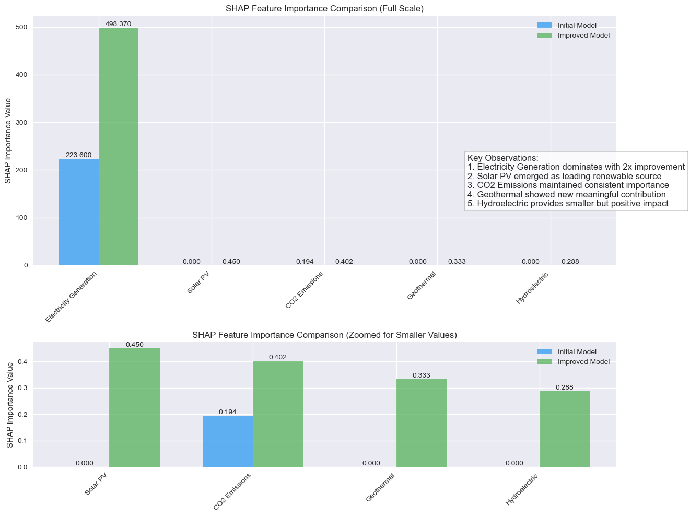

# Eco-Resource Optimization using EAs and SHAP

This project focuses on optimizing energy resource distribution for environmental sustainability using **Evolutionary Algorithms (EA)** and **SHapley Additive exPlanations (SHAP)** for interpretability. The project involves fine-tuning the optimization process by leveraging renewable energy sources while balancing CO2 emissions and overall electricity generation.

**Key observation**: The evolutionary algorithm for optimizing global energy distribution, achieved a best fitness score of **12821.54**. Through SHAP analysis, critical features such as **Electricity Generation (TWh)** (with a SHAP value of **498.38**) and **Solar PV (TWh)** (SHAP value of **0.45**) were identified as key contributors to the decision-making process.

## Requirements

1. **Datasets:**

   a)https://www.kaggle.com/datasets/jamesvandenberg/renewable-power-generation
   b)https://www.kaggle.com/datasets/iannjuguna/energy-data-since-1990
   c)https://www.kaggle.com/datasets/anshtanwar/global-data-on-sustainable-energy

After going through each datasets, they were first cleaned and standardized. Then after handled missing values they were merged on common attributes such as year, country, energy production, CO2 emissions, etc. This resulted in a comprehensive, unified dataset **(scaled_merged_dataset.csv)** containing all key features, which provided a holistic view of global energy generation, environmental impact, and renewable energy capacities for optimization.

2. **Tools:** Python, Jupyter Notebook, Evolutionary Algorithm module, SHAP.
3. **Libraries:** Pandas, NumPy, Matplotlib, Seaborn, Plotly, Scikit-learn.
   

## Results
All the results and visualizing observations graph can be fount at main.ipynb

**Fitness Score:** Achieved a best fitness score of **12821.54**

**SHAP Analysis:** Top features impacting the final solution:

   **Electricity Generation (TWh):** SHAP value of **498.38** (primary driver of optimization).
   
   **Solar PV (TWh):** SHAP value of **0.45** (significant renewable energy contributor).
   
   **CO2 Emissions:** Managed through controlled impact with moderate SHAP values.
